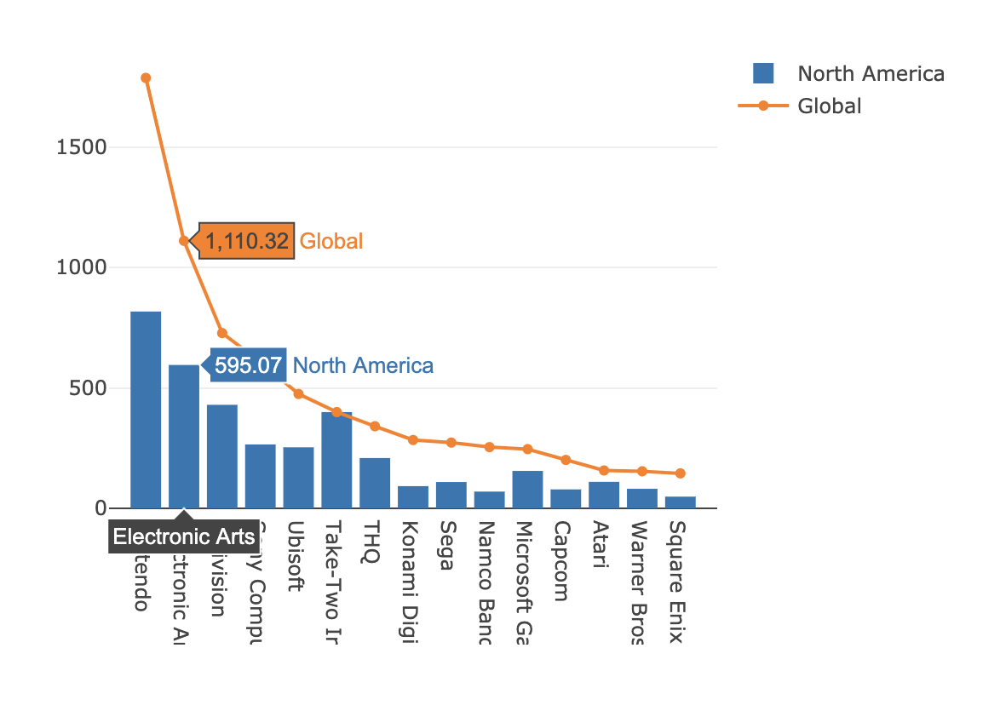
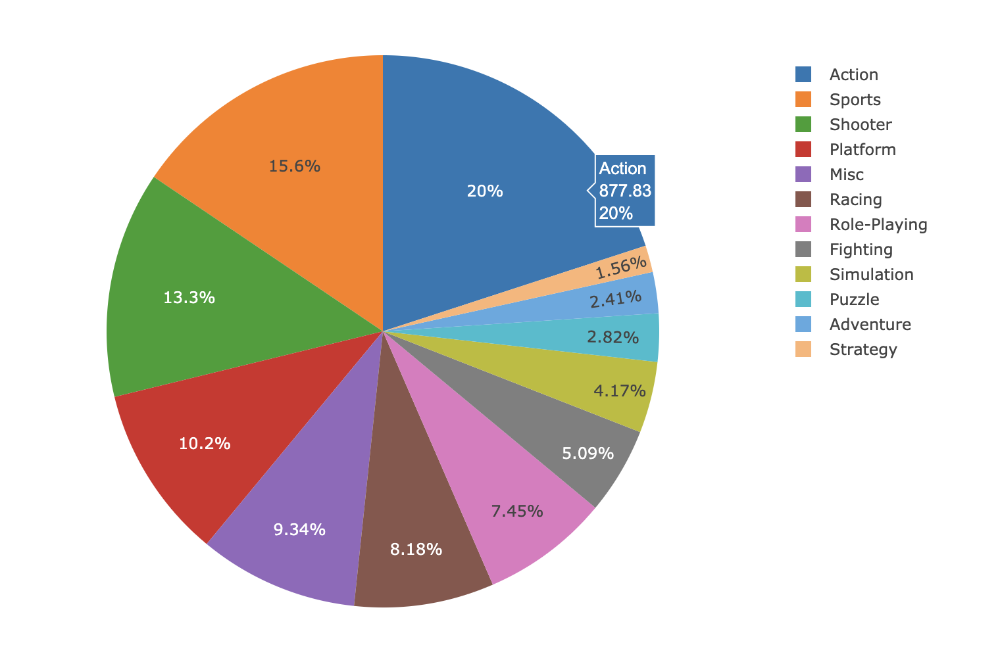

# PROJECT #2: VISUALIZE ME, CAPTAIN!

## Topic: Analyzing and Visualizing Global Video Game Sales Data from 1980 to 2020

### Project Team Name: Tom Nook Analytics
Members: Hannah Golledge, Hung Nguyen, Monte Rodriguez, Peter Lu

Dataset: https://www.kaggle.com/gregorut/videogamesales

GitHub Link: https://github.com/monter0424/ProjectTwo

Dataset Details: 7 columns x 16599 rows

## Storytelling: 
Using the obtained csv dataset, we provide insights on video game sales across different types of gaming platforms, genres, years, publishers and regions. 

## Interactivity: 
Utilizing Python Pandas on the back-end and JavaScript and D3 on the front-end, we created an interactive website with multiple web pages that allow users to navigate different sales outcomes in the various categories outlined above.

